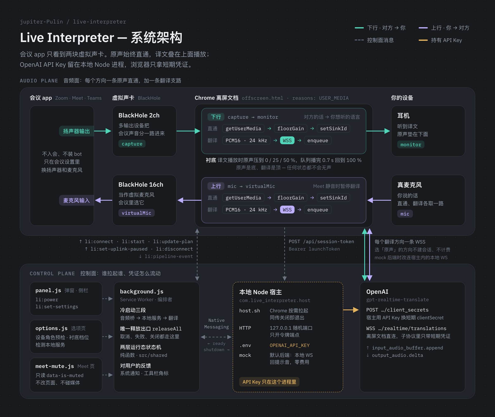
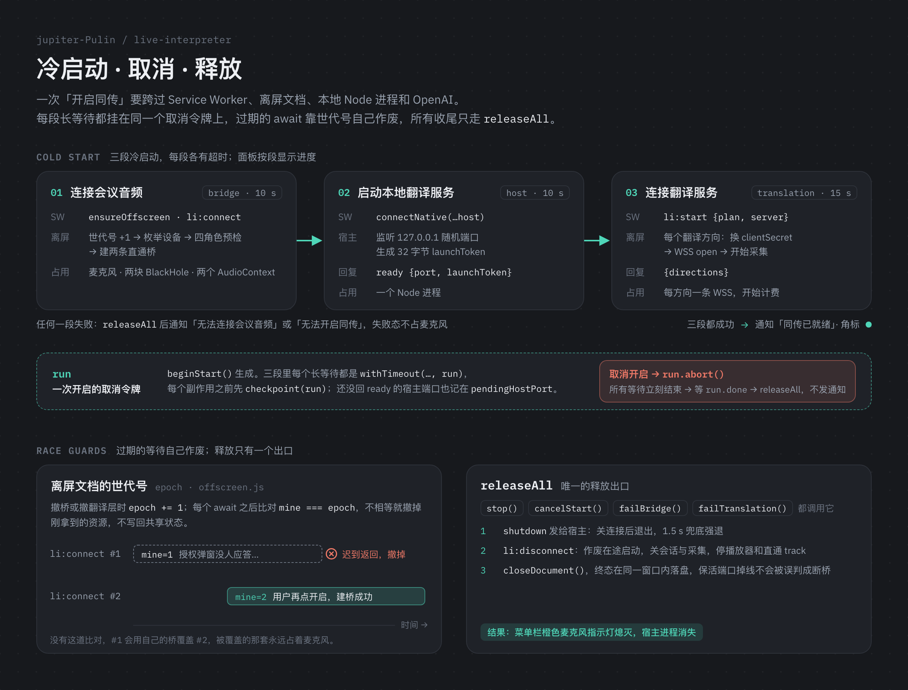

# live-interpreter

macOS 本地实时会议同传：BlackHole 音频路由 + OpenAI `gpt-realtime-translate` 双向翻译，装成 Chrome 扩展。对会议软件（Zoom / Meet / Teams）完全透明，不入会、不装 bot。

- **下行**：会议 app 输出 → BlackHole 截获 → 翻成你想听的语言 → 你的耳机
- **上行**：你的真麦克风 → 翻成对方听的语言 → 第二块 BlackHole（虚拟麦克风）→ 会议对方
- **原声是底，翻译是顶**：连上之后两个方向的原声一直直通；翻译播放时原声压低，停顿即恢复，任何状态都不会无声。

**目录**：[架构](#架构) · [部署指南](#部署指南) · [使用](#使用) · [核心难点解析](#核心难点解析) · [自动化测试](#自动化测试)

## 架构



整张图分两层看：

- **音频面**（上半）：会议 app 只和两块虚拟声卡打交道。下行 `capture → monitor`：会议声音经多输出设备进入 BlackHole 2ch，离屏文档里一条直通（`getUserMedia → floorGain → setSinkId`）把原声送进耳机；另一条翻译支路把 24 kHz PCM16 按约 170 ms 一块送上 WSS，译文回来后 `enqueue` 到同一个出口。上行 `mic → virtualMic` 结构对称，出口是 BlackHole 16ch，也就是会议里选的那个麦克风。
- **控制面**（下半）：Service Worker 只编排，不碰音频；`getUserMedia`、AudioContext 和 WebSocket 全都在离屏文档里（MV3 的 Service Worker 没有 DOM，还会被随时回收）。本地 Node 宿主由 Chrome 经 Native Messaging 按需拉起，持有 `OPENAI_API_KEY`，只在 `127.0.0.1` 的随机端口上开一个令牌端点；离屏文档凭启动令牌换来短期 `clientSecret`，再直连 OpenAI。
- **判定与接线分离**：设备预检、衬底规则、方向计划、运行态状态机、协议帧和错误分类都是 `src/shared/` 里的纯函数（Node 可测、浏览器可直接加载）；`background.js`、`offscreen.js`、面板、选项页和内容脚本只做接线。`tests/unit/shared-purity.test.mjs` 与 `tests/unit/extension-static.test.mjs` 用静态检查守住这条边界。

代码结构：

```
src/shared/     纯逻辑（Node 可测 + 浏览器可直接加载）：设备预检、路由与衬底、
                语言目录与方向计划、两层运行态状态机与全部界面/通知文案、
                会话协议、Meet 静音解析、Native Messaging 协议帧、错误分类
src/extension/  扩展本体（零打包器）：service worker 编排、离屏文档跑音频桥与
                翻译层、只读 Meet 静音探测、弹窗/侧栏面板、选项页
src/server/     Native Messaging 宿主 + 令牌端点 + mock 翻译会话（ws）
tests/          node --test：单元（纯逻辑）+ 静态（接线纪律）+ 集成（宿主协议、
                令牌鉴权、构建与安装、service worker 编排全流程）
tools/          构建、宿主安装、扩展 ID 推导、图标生成、真实链路 e2e
docs/assets/    本页的架构图
```

## 部署指南

所有组件都跑在你自己的 Mac 上：一个 Chrome 扩展，加一个只在同传开启期间存在的本地 Node 进程。没有需要托管的服务器。

### 环境要求

| 依赖 | 为什么需要 | 自检 |
| --- | --- | --- |
| macOS | 音频路由靠 BlackHole；Native Messaging 宿主清单写在 `~/Library/Application Support/` 下 | — |
| Chrome ≥ 116 | 扩展用到离屏文档、侧栏和 `AudioContext.setSinkId`（把声音输出到指定设备），以及 116 起才有的 `chrome.runtime.getContexts` 与 `chrome.sidePanel.open` | `chrome://version` |
| Node ≥ 22 | 宿主脚本用 `--env-file` 读 `.env`，测试用 `node --test` 的 glob，真实链路 e2e 用内置全局 `WebSocket` | `node -v` |
| BlackHole 2ch + 16ch | 两块独立的虚拟声卡：一块截获会议声音，一块当虚拟麦克风 | 「音频 MIDI 设置」里能看到两块 |
| 耳机（建议） | 外放时你的麦克风会把对方的声音再送回会议，容易产生回声 | — |

首次运行需联网安装依赖（唯一的运行时依赖是 `ws`，只给 mock 后端用）；离线环境请先在联网时执行一次 `npm install`。

### 1. 配置音频路由

1. **安装两块 BlackHole**（虚拟声卡，需手动安装）：
   - [BlackHole 2ch](https://existential.audio/blackhole/) —— 用作 `capture`（截获会议声音）
   - BlackHole 16ch —— 用作 `virtualMic`（虚拟麦克风）
   - 两个通道数变体安装后在系统中是**两块独立设备**，缺一不可。
2. **创建多输出设备**（让会议声音既进 BlackHole 又能被系统播出）：
   打开「音频 MIDI 设置」→ 左下 `+` → 「创建多输出设备」→ 勾选 **BlackHole 2ch**（可另勾内置扬声器方便调试）。
3. **会议 app 侧设置**：
   - 扬声器/输出设备 → 选刚建的**多输出设备**（或直接选 BlackHole 2ch）
   - 麦克风/输入设备 → 选 **BlackHole 16ch**
4. **开发期不用真会议**：用 QuickTime 等系统播放器回放一段英语音频（可用 `say -o fixtures/sample-en.wav --data-format=LEF32@22050 "Hello, this is a test."` 生成），声音经多输出设备灌入 BlackHole 2ch，即等价于会议对方在说话。

### 2. 构建扩展并注册本地宿主

```bash
npm install          # 首次
npm run build:ext    # src/extension + src/shared → dist/extension
npm run install:host # 生成 dist/native-host/host.sh，并注册 Native Messaging 宿主
```

`install:host` 写两个文件，可以重复运行：

- `dist/native-host/host.sh`：先 `cd` 到仓库，再用**当前 node 的绝对路径**执行 `src/server/native-host.mjs`；仓库里有 `.env` 时带上 `--env-file=.env`。从 Dock 启动的 Chrome 只给子进程一个极简的 PATH，所以这里不依赖 `node` 在 PATH 里。
- `~/Library/Application Support/Google/Chrome/NativeMessagingHosts/com.live_interpreter.host.json`：宿主清单，`allowed_origins` 只放行本扩展。扩展 ID 由 `manifest.json` 中提交的公钥推导，所以固定不变。

用 Edge 时运行 `npm run install:host -- --browser edge`。**移动仓库目录或升级 Node 之后要重跑一次**（`host.sh` 里写死了仓库路径和 node 路径）。

### 3. 加载扩展并自检

1. 打开 `chrome://extensions` → 右上角开启「开发者模式」→「加载已解压的扩展程序」→ 选择 `dist/extension`。
2. 安装时 Chrome 会提示扩展可以「读取你在 meet.google.com 上的数据」。这条提示来自唯一的一个内容脚本：它**只读** Google Meet 麦克风按钮的 `data-is-muted` 属性，用来知道你有没有在会议里静音。它不修改页面、不注入任何界面、不访问网络、不碰媒体设备（`tests/unit/extension-static.test.mjs` 里有静态检查钉住这条）。
3. 右键扩展图标 →「选项」：授权麦克风、确认四个设备角色「设备已就绪」、选原声衬底档位、点「检测本地服务」确认本地服务能被拉起（会显示后端、端口与版本）。

### 4. 切到真实翻译后端

默认后端是 **mock**：本地 WS 回提示音，不连 OpenAI、零费用，适合先把音频路由调通。要走真 API：

```bash
cp .env.example .env
# 在 .env 里填写：
#   OPENAI_API_KEY=<你的 key>
#   TRANSLATE_BACKEND=real
```

宿主每次冷启动都会重新读 `.env`，改完后下次点「开启同传」即生效。

| 变量 | 默认 | 作用 |
| --- | --- | --- |
| `OPENAI_API_KEY` | 空 | 宿主用它换发短期凭证；真实后端必填 |
| `TRANSLATE_BACKEND` | mock | 只有值为 `real` 时才连 OpenAI |
| `LI_HOST_LOG` | `dist/native-host/host.log` | 宿主日志位置 |

`.env.example` 里的 `PORT` 目前不被读取：宿主总是监听 `127.0.0.1` 上的随机端口。

`OPENAI_API_KEY` 只存在于本地 Node 进程；扩展只拿到每次启动生成的启动令牌和按会话换发的短期凭证，两者都不写入 `chrome.storage`。

### 5. 验证

- `npm test` 全部通过（mock 后端，不打真 API、不碰真设备）。
- 选项页「检测本地服务」能显示后端、端口与版本。
- 在会议页面点工具栏图标 →「开启同传」：系统通知「同传已就绪」、工具栏图标出现绿点即部署完成。mock 后端下译文是本地生成的提示音，能在耳机里听到就说明出口设备选对了。
- 切到真实后端后，可以用 `npm run e2e:real`（约 $0.05/次）单独验证 OpenAI 链路。

### 升级与卸载

- **更新代码**：`npm run build:ext`，再在 `chrome://extensions` 里点扩展的「重新加载」。
- **升级 Node 或移动仓库**：重跑 `npm run install:host`。
- **卸载**：移除扩展；删除 `~/Library/Application Support/Google/Chrome/NativeMessagingHosts/com.live_interpreter.host.json`；可选删除 `dist/`；把会议 app 的扬声器和麦克风切回真实设备。

### 常见问题

| 现象 | 原因与处理 |
| --- | --- |
| 「未检测到 BlackHole 虚拟声卡」或「只检测到一块 BlackHole 设备」 | 两个通道数的 BlackHole 都要装（建议 2ch + 16ch），装完重启 Chrome |
| 「capture 与 virtualMic 必须使用两块不同的 BlackHole 设备」 | 在选项页把这两个角色分到两块不同的 BlackHole 上 |
| 「不能使用 BlackHole 设备：这会造成自听回环」或「不能使用多输出/聚合设备」 | 耳机或麦克风角色选到了虚拟设备，系统会去翻译自己播出的译文；在选项页把 `monitor` / `mic` 改回真实的耳机和麦克风 |
| 「本地翻译服务不可用」 | 没跑 `npm run install:host`，或者升级 Node、移动仓库后没有重跑；宿主日志在 `dist/native-host/host.log` |
| 「缺少必要配置：…OPENAI_API_KEY…」 | 设了 `TRANSLATE_BACKEND=real`，但 `.env` 里没填 key |
| 关闭同传后对方听不到你、你也听不到对方 | 关闭后插件不再转送任何声音；在会议里把麦克风和扬声器切回真实设备，或者重新开启同传 |
| 听到回声 | 戴耳机；外放的声音会被麦克风再次收进会议 |

## 使用

### 开启同传

在会议页面点工具栏的扩展图标 →「开启同传」。这是一次冷启动，按钮转圈并依次显示三段进度：

1. **正在连接会议音频…** —— 建立音频桥：两个方向各一条「输入设备 → 增益 → 输出设备」的直通路。
2. **正在启动本地翻译服务…** —— 通过 Native Messaging 拉起本地 Node 进程（只在同传开启期间存在）。
3. **正在连接翻译服务…** —— 为每个需要翻译的方向建立会话并启动采集。

两个方向都真正就绪后，macOS 会弹出系统通知「同传已就绪」，写明这一次的两个方向各会怎么处理；工具栏图标出现绿点。开启途中主按钮是**「取消开启」**，任何一步都可以点它立即放弃，已经建立的连接与本地服务会全部撤掉，不弹通知。任何一步失败会弹通知说明原因：会议音频连不上时标题是「无法连接会议音频」，翻译起不来时标题是「无法开启同传」；两种情况都已释放麦克风。

插件**不会自动连接**：浏览器启动、扩展安装、后台唤醒都不会占用麦克风或拉起本地服务，只有你点「开启同传」才会。

### 原声衬底与关闭

- 同传进行中：原声一直在（对方原声进你的耳机、你的原声进会议），翻译播放时原声压到你选的衬底档位（0% / 25%（默认）/ 50%），译文队列播完 0.7 秒后恢复 100%。
- **「关闭同传」即释放一切**：翻译、本地服务（`pgrep -f native-host.mjs` 无结果）、麦克风与全部音频设备都释放，macOS 菜单栏的橙色麦克风指示随之消失，工具栏图标无角标。失败后同样如此：插件只在同传开启期间占用麦克风。
- **关闭后插件不再转送任何声音**：会议里的麦克风如果仍选着 BlackHole 16ch，对方会听不到你；扬声器如果只选了 BlackHole 2ch，你也听不到对方。需要不经翻译的普通通话时，在会议设置里把麦克风和扬声器切回真实设备，或者重新开启同传。
- 浏览器关闭即释放一切；下次打开是「同传已关闭」。

### Meet 静音

你在 **Google Meet** 里点静音时，插件会在 0.5 秒内暂停翻译你的话：不再把麦克风音频送去翻译（因此不计费、也不会把旁边的谈话送出去）、丢弃已经排队的你的译文、你的原声保持不变。对方的话继续翻给你听。取消静音立即恢复；如果暂停期间上行会话被对端关闭，恢复时会自动重建（面板会短暂显示「正在恢复翻译…」）。

只有 Google Meet 网页版能被感知。在 Zoom / Teams 等其它平台，面板会常显「未感知到会议静音（仅支持 Google Meet）」，翻译照常进行——静音与否请自行判断。Meet 改版导致读不到按钮时同样退化为「未知」，不会误停。

### 语言能力与限制

- 面板只有两个下拉：**「你想听的语言」**（下行目标）与**「对方听的语言」**（上行目标），各是 13 种输出语言之一或「原声（不翻译）」。默认中文 / English，选择会被记住。
- **没有「你说的语言」**：输入语言由模型自动识别（官方支持 70+ 种）。
- 13 种输出语言：中文、English、日本語、한국어、Español、Français、Português、Deutsch、Italiano、Русский、हिन्दी、Bahasa Indonesia、Tiếng Việt。
- 某个方向选「原声（不翻译）」时，该方向不建会话、不采集、不计费，原声 100% 直通。
- 进行中改语言只重建受影响的那个方向，另一个方向不受影响。
- **同语言片段可能不出声**：当你说的话已经是「对方听的语言」时，模型倾向于不翻译该片段——此时衬底规则会让对方听到你 100% 的原声，而不是一段静音。
- **每句开头有 1–2 秒未压低的原声**：译文比原声晚到，这是上游延迟，本版不消除。

## 核心难点解析

一次同传要穿过会议 app、macOS 虚拟声卡、Chrome 扩展的几个上下文、本地 Node 进程和 OpenAI。难的不是调用翻译 API，而是让这条链路在真实设备上**不回环、不无声、不泄密，并且关得干净**。下面七个问题按对设计的影响排序。



### 1. 跨四个执行上下文的冷启动、取消与释放

**问题**：一次「开启同传」依次经过面板、Service Worker、离屏文档、本地 Node 进程和 OpenAI。授权弹窗、拉起进程、换发凭证、WebSocket 握手都是长等待，结果可能在你点了「取消开启」或已经超时之后才回来。如果回来的那一刻照常往下执行，就会重新占住麦克风、留下没人管的 AudioContext，或者让一条计费会话一直开着。

**做法**（见上图）：

- **取消令牌**：Service Worker 每次开启生成一个 `run`（`beginStart`）。三段长等待都包在 `withTimeout(…, run)` 里，`run.abort()` 让它们立刻结束；每个副作用之前先 `checkpoint(run)`。还没回 `ready` 的宿主端口记在 `pendingHostPort`，取消时一并断开，迟到的 `ready` 直接忽略。
- **世代号**：离屏文档撤桥或撤翻译层时 `epoch += 1`；`connectBridge`、`startDirection`、`startTranslation`、`updatePlan` 在每个 await 之后比对 `mine === epoch`，过期就撤掉刚拿到的资源，不写回共享状态。
- **唯一出口**：关闭、取消和两类失败都只调用 `releaseAll`：先给宿主发 `shutdown`，再用 `li:disconnect` 关掉会话、采集、播放器和直通 track，最后 `closeDocument()`，并在同一个窗口内写入终态，这样关文档时断开的保活端口不会被误判成断桥。

**证据**：`tests/integration/background-flow.test.mjs`、`tests/integration/offscreen-flow.test.mjs` 覆盖取消、超时和重叠启动；对应修复见提交 `90c2b6a`、`f36c5ff`、`2d709af`。

### 2. 双向路由不形成回环

**问题**：同一台机器上既要把会议声音翻给你，又要把你的话翻给会议。任何一个设备角色选重，系统就会去翻译自己刚播出的译文——实机踩过，表现为译文无限重复。多输出或聚合设备还可能把 BlackHole 包在里面，从浏览器侧看不出来；Chrome 又会给同一块设备的输入端和输出端分配相同的 deviceId。

**做法**：四个角色 `capture`、`virtualMic`、`monitor`、`mic` 由纯函数 `src/shared/device-preflight.mjs` 预检：`capture` 与 `virtualMic` 必须落在两块不同的物理设备上；`monitor` 与 `mic` 不能是 BlackHole，也不能是多输出/聚合设备；用户的手动指定按 `kind:deviceId` 查找。每个方向各有一个播放用的 AudioContext，用 `setSinkId` 绑到各自的输出设备。

**证据**：`tests/unit/device-preflight.test.mjs`；实机回环的记录写在预检源码的注释里。

### 3. 「原声是底、翻译是顶」，任何时刻都不无声

**问题**：译文比原声晚 1–2 秒；你说的已经是目标语言时，模型可能干脆不出声。如果翻译期间把原声关掉，就会出现什么都听不到的空窗。

**做法**：直通路从连上起一直开着。压低多少、何时恢复由纯函数 `src/shared/floor.mjs` 决定：译文播放期间把直通增益压到 0 / 25 / 50 %，队列播完 0.7 s 后回到 1.0。`audio.js` 只负责执行：50 ms 压低、200 ms 恢复的线性渐变，外加一个到点复查的定时器；`queued` 标志避免新建 AudioContext 的头 0.7 s 被误判为「正在翻译」；上行暂停时，以及选了「原声」的方向，增益始终保持 1.0。

**证据**：`tests/unit/floor.test.mjs`、`tests/unit/player-static.test.mjs`、`tests/integration/offscreen-flow.test.mjs`；提交 `8c5c6d3`。

### 4. MV3 的生命周期，与「关闭即释放麦克风」

**问题**：MV3 的 Service Worker 没有 DOM，空闲后还会被回收，拿不了音频；而用户判断「插件还在不在听」的唯一依据，是菜单栏的橙色麦克风指示灯。

**做法**：音频全部放进 `reasons: ['USER_MEDIA']` 的离屏文档。Service Worker 只把运行态镜像到 `chrome.storage.session`，醒来后由纯函数 `planRecovery` 决定怎么收拾，并且从不自己去抢设备；离屏文档与 Service Worker 之间有 20 s 心跳的保活端口。插件从不自动连接：浏览器启动、安装扩展、后台唤醒都不会占用麦克风或拉起本地服务。

**证据**：`tests/integration/background-flow.test.mjs`、`tests/unit/extension-static.test.mjs`；提交 `2d709af` 就是实机发现关闭后橙色指示灯仍亮之后的修复。

### 5. API Key 不进浏览器

**问题**：翻译要从浏览器实时直连 OpenAI，但扩展代码和 `chrome.storage` 都不是放长期密钥的地方。

**做法**：`OPENAI_API_KEY` 只由本地宿主经 `--env-file` 读取。宿主每次启动生成 32 字节的启动令牌，经 Native Messaging 交给 Service Worker，只存在内存里；令牌端点只认 `Authorization: Bearer <launchToken>`，返回每个会话一次的短期 `clientSecret`，离屏文档把它放进 WebSocket 子协议直连 OpenAI。构建只拷贝 `src/extension` 和 `src/shared`，`.env` 与 `src/server` 不会进扩展包；写进 `chrome.storage.session` 的服务信息先经 `stripSecrets`，只留下 `{port, backend}`。

**证据**：`tests/integration/token-endpoint.test.mjs`（缺少或错误的令牌返回 401，且不会去换凭证；响应里不含 key）、`tests/integration/build-extension.test.mjs`、`tests/unit/repo-hygiene.test.mjs`（对所有被跟踪文件做密钥扫描）。

### 6. 在 macOS 上把 Native Messaging 做稳

**问题**：Native Messaging 在 stdin/stdout 上传「4 字节小端长度 + UTF-8 JSON」帧，stdout 上多出一个字节，Chrome 就会断开连接；从 Dock 启动的 Chrome 只给子进程一个极简的 PATH。

**做法**：宿主把 `console.log` 重定向到 stderr，日志另写 `host.log`；帧解码器能处理逐字节到达、半包和粘包，遇到超过 1 MiB 或不合法的帧就永久停止；`host.sh` 写死 node 的绝对路径并先 `cd` 到仓库；扩展 ID 由提交的公钥固定，宿主清单只放行这一个 ID。

**证据**：`tests/integration/native-host.test.mjs`（stdout 上只有协议帧）、`tests/unit/native-protocol.test.mjs`、`tests/integration/install-native-host.test.mjs`。

### 7. 只读地感知 Meet 静音

**问题**：你在 Meet 里按下静音时，应该停止把你的话送去翻译（不计费，也不把旁边的谈话送出去）；但扩展不能改页面、不能碰媒体，也没有 `tabs` 权限。

**做法**：内容脚本只读 `[data-is-muted]`，节流后把原始快照交给 Service Worker（经典脚本不能 import）；判定是纯函数，分两遍：先认图标连字 `mic` / `mic_off`，都没命中才用 aria 文案兜底，避免把远端参会者的静音当成你的。没有 `tabs` 权限时 Chrome 会把 `sender.tab.url` 裁掉，所以来源校验同时接受 `sender.url`——漏掉这一条时，整条静音链路在实机上完全失效。暂停只作用于上行翻译：丢弃已经排队的你的译文，原声照常；暂停期间上行会话若被对端关闭，取消静音时自动重建。

**证据**：`tests/unit/meeting-mute.test.mjs`、`tests/unit/extension-static.test.mjs`（内容脚本只读的静态约束）；提交 `8c5c6d3`、`dbc09d3`。

## 自动化测试

```bash
npm test             # 全部自动化测试（mock 后端，不打真 API、不碰真设备）
npm run e2e:real     # 真实链路端到端自检，约 $0.05/次，故不进 npm test
```

`npm test` 在 Node 里直接运行真实的 `background.js` 与 `offscreen.js`（只改写 import 路径），配上假的 Web Audio、WebSocket 和 `chrome.*`，覆盖 service worker 编排全流程、离屏文档的竞态、宿主协议与令牌鉴权。

`npm run e2e:real` 与扩展共用令牌交换和实时翻译协议，但不经过 Native Messaging 和浏览器音频图：在进程内起本地服务 → `/api/session-token` 换 ephemeral secret → 连 OpenAI realtime translations WS → 按 ~170ms/块实时灌入 `fixtures/sample-en.wav` → 校验中文字幕、译文音频、句尾提交（合成 `completed`）均回流且全程无 error。
